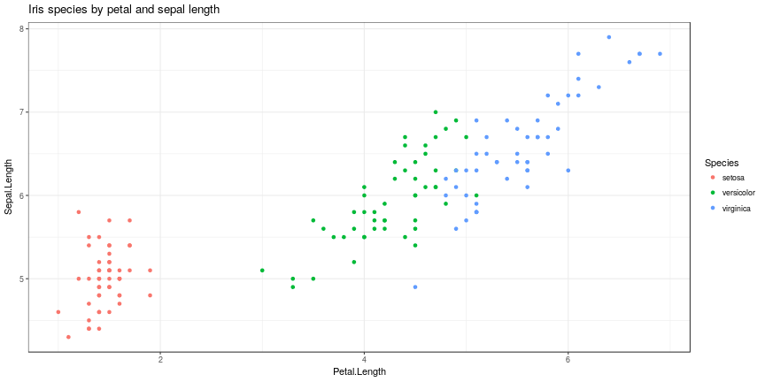

## Task

- Build a shiny application having the following properties
- Some user input widgets (e.g. slider)
- Reactive output displayed in the app
- Directly included documentation

--- 
## Dataset

We use the iris data set to build our web application. We performed the following exploratory data analysis on the data (code is embedded).

--- 
## Solution

- Interactive web app to set petal and sepal length
- User input gets displayed in the graph
- User can evaluate the result in the diagram
- A random forest model is build to predict the species according to the input provided by the user

--- 
## Links

- Link to the webapp: https://latenightcoder0815.shinyapps.io/iris/
- Link to the github repo: https://github.com/LateNightCoder0815/developingdataproducts3
- Information on the data set: https://stat.ethz.ch/R-manual/R-devel/library/datasets/html/iris.html

